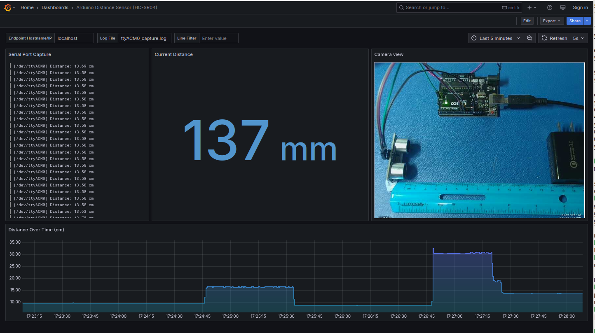

# Grafana Server

Grafana is a powerful visualization and analytics platform that transforms your system's data into beautiful, insightful dashboards. This implementation combines Grafana with Promtail and Loki to create a complete logging and metrics visualization stack, perfect for embedded systems development.

With this setup, Promtail collects your logs, Loki stores and indexes them, and Grafana presents everything in customizable dashboards where you can:

- **Real-time System Monitoring**: Watch CPU usage, memory consumption, and I/O patterns live
- **Hardware Debugging**: Visualize sensor data, communication protocols, and interrupt patterns
- **Log Aggregation**: Centralize logs from multiple embedded devices in one dashboard
- **Custom Alerting**: Set up alerts for critical system events like memory leaks or temperature thresholds
- **Time-Series Analysis**: Track performance metrics over time to identify patterns and anomalies
- **Cross-Device Correlation**: Compare behaviors across different devices or firmware versions

Whether you're working with IoT devices, embedded Linux systems, or any hardware development project, this stack gives you the visibility you need. Visualize any data source - from simple CSV files to complex system logs and real-time metrics.

This proven stack can be quickly deployed using Docker. Simply download the repo. If necessary, use the installation scripts to install docker & docker compose on your machine. And then, run the server with docker compose easily.

## Dashboard Examples




# Quick Start

Run the following steps to install docker to proper versions & set the right permissions

```bash
sudo chmod +x *.sh
./get-docker.sh
./post_install.sh
```
The `post_install.sh` will verify the installation. If that passes, you can safely run the following command to run the grafana server

```bash
docker compose up -d
```

If this doesn't work, there may be some issue with permissions with the associated volumes or for the ports

You can pull up the example dashboards in grafana with the following command. You may use firefox or any other browser.

```bash
firefox http://localhost:3000/dashboards
```

# Beacon Mode

You can start only the promtail instance if you want to send the logs from the host to another you have network access to, also known as "Beacon Mode". This can be done in the following two steps. 

1. Obtain your loki push API URL from your loki instance (it's similar to the default compose file, simply change the hostname to the remote host)
2. Replace line 6 of `promtail-beacon-compose.yaml` with the Loki URL obtained in step 1.
```
      - LOKI_URL=<LOKI PUSH URL> # You can set this to the push URL of your Loki instance 
```
3. Run the command `docker compose up -f promatil-beacon-compose.yaml` in the root of the repo.

The beacon will send the logs to a "Receiver" instance of the stack on another computer.

If you want to run promtail to collect logs with your receive, you can run the normal docker compose up command.

`docker compose up -d`

If you don't want to run promtail on your receiver (like if you're running in a cloud server), you can avoid the promtail service with the following command.

`docker compose up grafana loki -d`